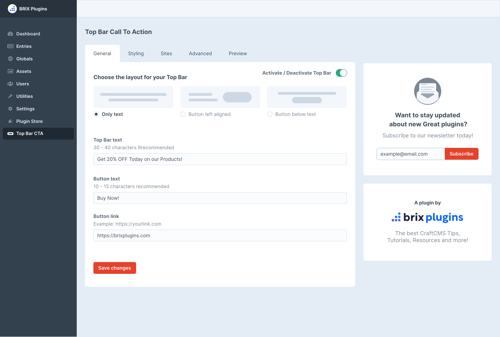

# Top Bar Call To Action plugin for Craft CMS 3.x

Top Bar CTA is the first Craft CMS plugin by BRIX Plugins, and it was created to help you easily add notification or CTA bars above your header menu with no code or technical complexity.

Want to promote an important company announcement through your site? Want to offer a special 20% OFF coupon for a holiday promo? **This is the plugin for you.**

## Top Bar CTA – Features

- **Layout Selector:** Choose between 3 different layouts available; Only text, Text plus right aligned button, and text and button below.

- **Customizable:** Customize the top bar to match your brand guidelines as easy as 1, 2, 3. Choose background, text, and button colors easily, and if you want to go even further, we have an option to add Custom CSS to make it look any way you want.

- **Perfectly Responsive:** Our top bar CTA is perfectly responsive, so you can enable it for mobile and tablet too (if  you want to), or disable it if you prefer to only show the announcement to Desktop users.

## Requirements

This plugin requires Craft CMS 3.0.0 or later.

## Installation

To install the plugin, follow these instructions.

1. Open your terminal and go to your Craft project:

        cd /path/to/project

2. Then tell Composer to load the plugin:

        composer require brixplugins/top-bar-call-to-action

3. In the Control Panel, go to Settings → Plugins and click the “Install” button for Top Bar Call To Action.

## Top Bar Call To Action Overview

-Insert text here-

## Configuring Top Bar Call To Action

Just installed our plugin and you are confused about how to use it? No worries, it’s as simple as possible, and we will cover it all in this short documentation.

Once you purchase and install our plugin, you will notice a new extra element named ‘Top Bar CTA’ on the left of your Craft CMS sidebar.

If you click on it, it will drive you to the Top Bar CTA plugin settings page, which include 5 main tabs.

## Using Top Bar Call To Action

The tabs are the following, and we will cover all options inside each.

### Tab 1: General

On the general tab, you will be able to select your top bar CTA layout, as well as the text content and link for the button. The settings included are the following:

- **Layout Selection:** Use this setting to select between the 3 layouts available for your top bar CTA.
- **Top Bar Text:** Use this field to write the text you want the top bar CTA to show. Remember to keep it at 30 – 40 characters, otherwise it would look very big on mobile, tablet or small screens.
- **Button Text:** Use this field to write the anchor text for your button. It’s recommended to keep it short (i.e. Get Started, Start Free Trial, etc).
- **Button Link:** Use this field to add the desired link for your button. Remember you can add UTM or referral tags to get tracking data of how many people clicked it.
- **Activate / Deactive Top Bar:** This toggle will allow you to enable or disable the top bar as needed.
- **Save Changes:** Once you are finished with choosing the layout and adding the text, just click Save Changes and it will be updated sitewide.

### Tab 2: Styling

On the styling tab you will be able to choose the colors of your Top Bar CTA, to ensure these match your brand styling.

- **Background Color:** Use this setting to choose the background color of the top bar call to action.
- **Button Background Color:** Use this setting to choose the background color of your top bar call to action button. It’s recommended for it to have a good contrast in between the background color of the top bar, to ensure a higher CTR.
- **Button Text Color:** Use this setting to choose the text color of your top bar call to action button text.
- **Text Color:** Use this setting to choose the color of your top bar call to action text.

### Tab 3: Sites

On the Sites tab you will be able to select on which sites you would like to apply your Top Bar CTA.

Click on the toggle at the right of each of the sites, and it will automatically enable the top bar on that particular site.

### Tab 4: Advanced
On the Advanced tab you will be able to toggle certain advanced settings for your top bar CTA.

- **Activate on Mobile & Table:** This will enable or disable the top bar CTA on mobile and tablet devices.
- **Custom CSS:** Use this setting to enable the Custom CSS field for your top bar CTA. With this field, you will be able to add any CSS needed to make your top bar CTA look exactly as you want it.

### Tab 5: Preview

On the Preview tab you will be able to preview the top bar CTA without making it public on your website. This is very handy if you are trying multiple texts and button CTAs to find the best one before pushing it live.

Brought to you by [BRIX Plugins](https://brixplugins.com/)
